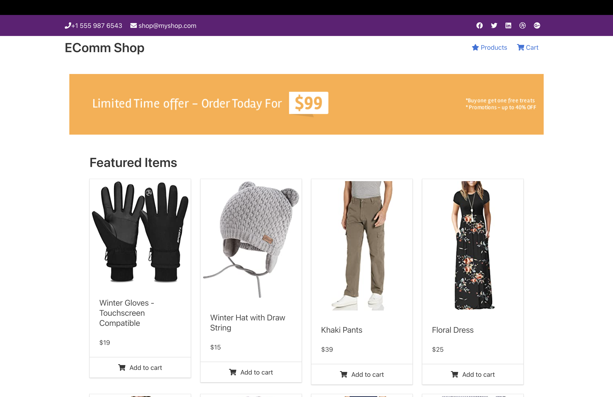

# **About**

This project is an ecommerce app that allows you to browse products and add them to your cart. There is an admin portal that allows you to upload custom products or delete current ones and change prices. The focus of this project was: 
<ul>
<li>Routing and Subrouting with Express</li>
<li>Password Hashing with Salt</li>
<li>Input Sanitization and Validation with Express Validator</li>
<li>Data Modeling with Repository Approach</li>
<li>Reusable Class Repositories</li>
<li>No Static HTML Files</li>
</ul>

This app does not focus on scaling or using databases, the intended purpose of the app is listed above. 
 

 ### **Important Routes**

<ul>
<li>/signup - Create an admin protal account. </li>
<li>/signin - Sign in if you created an account. </li>
<li>/signout - Sign out of admin account. </li>
<li>/cart - View cart if it has items. </li>
<li>/admin/products - Upload or Change Products</li>
</ul>

More routes based on product ID's to add/update/delete, etc

### **To Run** 

<ul>
<li>The app runs on port 3001.</li>
<li>From the app directory type "npm install"</li>
<li>From the app directory type "npm run dev"</li>
<li>Visit localhost:3001 to access the project</li>
<li>Visit localhost:3001/signup to create an admin account</li>
</ul>

### **Preview**

